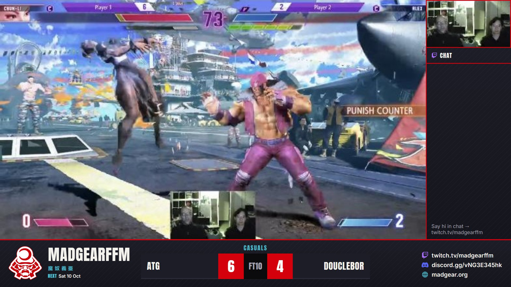
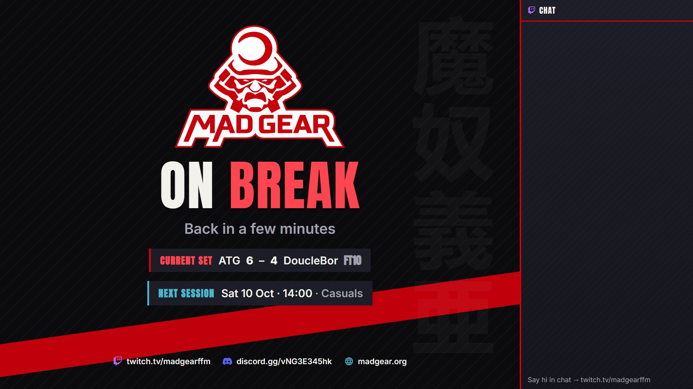
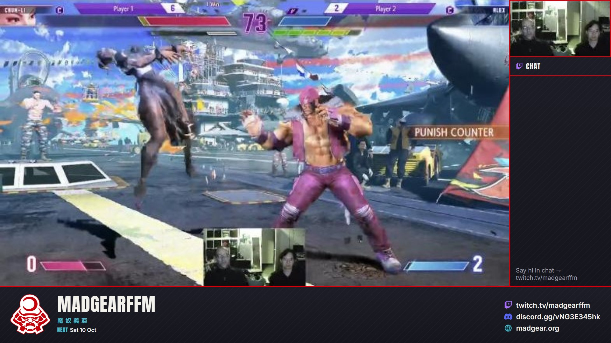

# MadGear stream overlays

Twitch scenes for SF6 locals: Starting Soon, Match, Match · Fullscreen, On Break, Ending.

Each scene is built from layers. Only the scoreboard needs the small local server. Everything else
works on its own, so if `start.bat` isn't running the stream still looks finished, just without scores.

| Layer | What | Needs `start.bat`? |
|---|---|---|
| Frame (PNG) | Logo, club name, socials, panels, headlines | No |
| Chat (`chat.html`) | Twitch chat, connects to Twitch directly | No |
| Sessions (`session.html`) | Today's session + next session from madgear.org (Google Calendar) | No |
| Score | Player names, scores, FT, set title | Yes |

| On break | Without server |
|---|---|
|  |  |

Before: [reference/twitch-current-ingame.jpg](reference/twitch-current-ingame.jpg) (Twitch, Oct 2026).

## Setup (once)

1. Install [Node.js](https://nodejs.org) (LTS) on the stream PC.
2. Copy this `stream` folder to its final place, then double-click `start.bat`.
   It writes `obs/MadGear.json` with the right file paths for this PC, then starts the score server.
   If Windows Firewall asks, allow *private networks* (needed for tablet/phone/ESP control).
3. OBS → *Scene Collection → Import* → `obs/MadGear.json` → switch to the **MadGear** collection.
4. Double-click **Game Capture** and **Player Cam**, pick your capture card and webcam.
5. Optional: *Docks → Custom Browser Docks* → `http://localhost:8123/control.html` for the score panel in OBS.

Moved the folder? Run `start.bat` and import again.

## During the stream

Run `start.bat`, start OBS. Sessions and chat fill themselves. Scores come from whatever is closest:

- **Deck (Mars Gaming MSD-ONE with OpenDeck, or any deck):** *Simulate Input* action with these shortcuts.

  | Button | Shortcut | | Button | Shortcut |
  |---|---|---|---|---|
  | P1 +1 | Ctrl+Alt+Shift+1 | | Scene: Starting Soon | Ctrl+Alt+Shift+F1 |
  | P1 −1 | Ctrl+Alt+Shift+2 | | Scene: Match | Ctrl+Alt+Shift+F2 |
  | P2 +1 | Ctrl+Alt+Shift+3 | | Scene: Match · Fullscreen | Ctrl+Alt+Shift+F3 |
  | P2 −1 | Ctrl+Alt+Shift+4 | | Scene: On Break | Ctrl+Alt+Shift+F4 |
  | Reset score | Ctrl+Alt+Shift+5 | | Scene: Ending | Ctrl+Alt+Shift+F5 |
  | Swap sides | Ctrl+Alt+Shift+6 | | | |

  Score shortcuts are caught by `start.bat`, anywhere in Windows (OBS doesn't need focus).
  Scene shortcuts are set in the imported OBS collection (*Settings → Hotkeys*).
- **Tablet / phone:** `http://<stream-PC-IP>:8123/control.html` on the same Wi-Fi (IP from `ipconfig`).
  Names, +/−, FT, swap, reset, set title.
- **ESP + OLED buttons:** `esp-scoreboard/esp-scoreboard.ino` (Arduino IDE). Two buttons from a pin to GND:
  tap = +1, hold = −1, hold both 2 s = reset. Set Wi-Fi, the stream PC's IP and pins at the top.
  Give the stream PC a fixed IP in the router.
- **Web requests** (anything that can call a URL):

  | Action | URL |
  |---|---|
  | P1 +1 / −1 | `http://localhost:8123/api/p1/plus` · `/api/p1/minus` |
  | P2 +1 / −1 | `/api/p2/plus` · `/api/p2/minus` |
  | Reset / Swap | `/api/reset` · `/api/swap` |
  | FT +1 / −1 | `/api/ft/plus` · `/api/ft/minus` |
  | Set anything | `/api/set?p1=ATG&p2=Maddo&ft=10&title=Money%20Match` |

The score stops at the FT number and the winner turns teal. It survives restarts (`state.json`).

## Sessions

`session.html` reads https://madgear.org/feed.json (the website's calendar data, rebuilt every 30 min).
- Big box (Starting / Break / Ending): **Today** or **Open now** with time and title, plus **Next session**.
- One line in the Match bar: `Open 14:00 – 00:00 · Next Sat 10 Oct`.
- The title comes from the calendar entry: "MadGearFFM - Casuals" shows as "Casuals".

## Change things

- Club name, socials, screen texts: `config.json`, then `node render-frames.mjs` to re-render the PNGs.
- Look of frames and scoreboard: the pages in `overlays/` (`match.html`, `fullscreen.html`, `screen.html`,
  colors in `common.css`). Re-render the PNGs after changes.
- Twitch channel for chat: top of `overlays/chat.html`.
- Where layers sit: `overlays/scenes.json` (used for the OBS collection and the preview).
- Preview all scenes with a sample SF6 frame: `http://localhost:8123/preview.html`.

Streamlabs: no direct import of this file. Recreate the scenes from `overlays/scenes.json`
(image sources for frames, browser sources for chat/sessions/score) or use OBS.
